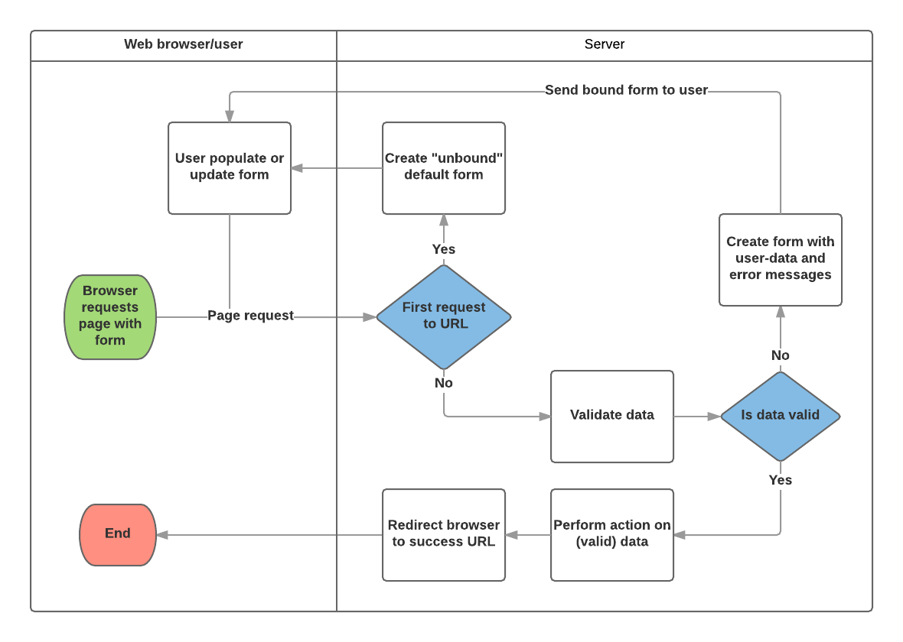

[Django Forms](https://developer.mozilla.org/en-US/docs/Learn/Server-side/Django/Forms)

Overview
 
An HTML Form is a group of one or more fields/widgets on a web page, which can be used to collect information from users for submission to a server. Forms are a flexible mechanism for collecting user input because there are suitable widgets for entering many different types of data, including text boxes, checkboxes, radio buttons, date pickers and so on. Forms are also a relatively secure way of sharing data with the server, as they allow us to send data in POST requests with cross-site request forgery protection.

The form is defined in HTML as a collection of elements inside \<form>...\</form> tags, containing at least one input element of type="submit".

# Django Handlling of forms.

What makes things more complicated is that the server also needs to be able to process data provided by the user, and redisplay the page if there are any errors.

A process flowchart of how Django handles form requests is shown below, starting with a request for a page containing a form (shown in green).

# Declaring a Form Syntax
The declaration syntax for a Form is very similar to that for declaring a Model, and shares the same field types (and some similar parameters). This makes sense because in both cases we need to ensure that each field handles the right types of data, is constrained to valid data, and has a description for display/documentation.
Form data is stored in an application's forms.py file, inside the application directory. Create and open the file locallibrary/catalog/forms.py. To create a Form, we import the forms library, derive from the Form class, and declare the form's fields. A very basic form class for our library book renewal form is shown below — add this to your new file:

# Form fields
In this case, we have a single DateField for entering the renewal date that will render in HTML with a blank value, the default label "Renewal date:", and some helpful usage text: "Enter a date between now and 4 weeks (default 3 weeks)." As none of the other optional arguments are specified the field will accept dates using the input_formats: YYYY-MM-DD (2016-11-06), MM/DD/YYYY (02/26/2016), MM/DD/YY (10/25/16), and will be rendered using the default widget: DateInput.

There are many other types of form fields, which you will largely recognise from their similarity to the equivalent model field classes: BooleanField, CharField, ChoiceField, TypedChoiceField, DateField, DateTimeField, DecimalField, DurationField, EmailField, FileField, FilePathField, FloatField, ImageField, IntegerField, GenericIPAddressField, MultipleChoiceField, TypedMultipleChoiceField, NullBooleanField, RegexField, SlugField, TimeField, URLField, UUIDField, ComboField, MultiValueField, SplitDateTimeField, ModelMultipleChoiceField, ModelChoiceField.

# Useable Arguments in a form
required: If True, the field may not be left blank or given a None value. Fields are required by default, so you would set required=False to allow blank values in the form.
label: The label to use when rendering the field in HTML. If a label is not specified, Django will create one from the field name by capitalizing the first letter and replacing underscores with spaces (e.g. Renewal date).
label_suffix: By default, a colon is displayed after the label (e.g. Renewal date:). This argument allows you to specify a different suffix containing other character(s).
initial: The initial value for the field when the form is displayed.
widget: The display widget to use.
help_text (as seen in the example above): Additional text that can be displayed in forms to explain how to use the field.
error_messages: A list of error messages for the field. You can override these with your own messages if needed.
validators: A list of functions that will be called on the field when it is validated.
localize: Enables the localization of form data input (see link for more information).
disabled: The field is displayed but its value cannot be edited if this is True. The default is False.

[Back To Homepage](https://leethomas13.github.io/201-reading-notes/)