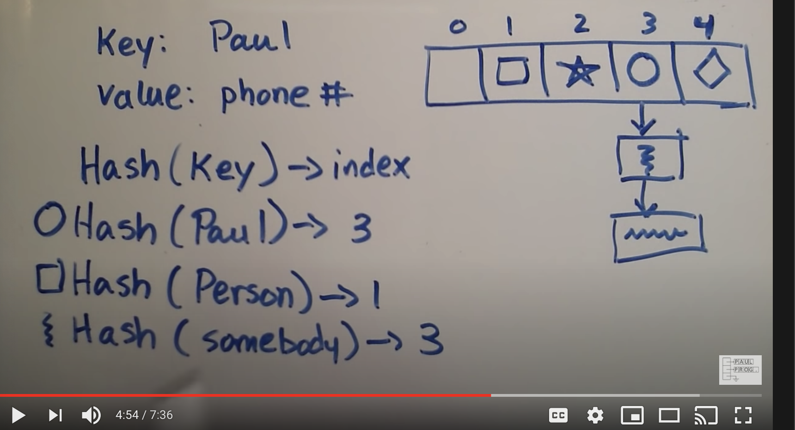

[Intro to Hash Tables](https://codefellows.github.io/common_curriculum/data_structures_and_algorithms/Code_401/class-30/resources/Hashtables.html)

Terminology:

Hash - A hash is the result of some algorithm taking an incoming string and converting it into a value that could be used for either security or some other purpose. In the case of a hashtable, it is used to determine the index of the array.
Buckets - A bucket is what is contained in each index of the array of the hashtable. Each index is a bucket. An index could potentially contain multiple key/value pairs if a collision occurs.
Collisions - A collision is what happens when more than one key gets hashed to the same location of the hashtable.

We use a hash table to hold unique values, for a dictionary, or a library

Internal Methods:

Add()
When adding a new key/value pair to a hashtable:

send the key to the GetHash method.
Once you determine the index of where it should be placed, go to that index
Check if something exists at that index already, if it doesn’t, add it with the key/value pair.
If something does exist, add the new key/value pair to the data structure within that bucket.
Find()
The Find takes in a key, gets the Hash, and goes to the index location specified. Once at the index location is found in the array, it is then the responsibility of the algorithm the iterate through the bucket and see if the key exists and return the value.

Contains()
The Contains method will accept a key, and return a bool on if that key exists inside the hashtable. The best way to do this is to have the contains call the GetHash and check the hashtable if the key exists in the table given the index returned.

GetHash()
The GetHash will accept a key as a string, conduct the hash, and then return the index of the array where the key/value should be placed.

[What is a Hash Table? (video)](https://www.youtube.com/watch?v=MfhjkfocRR0)

Heart of a hash table is an array structure. Table with Keys and Values. 

Make a hash function, takes in a key and returns the index number linked to the key.

If a key has the same index, we make a pseudo linked list to add them to the table to avoid the collision.

[Hash Table Basics](https://www.hackerearth.com/practice/data-structures/hash-tables/basics-of-hash-tables/tutorial/)

Hashing is a technique that is used to uniquely identify a specific object from a group of similar objects. Some examples of how hashing is used in our lives include:

In universities, each student is assigned a unique roll number that can be used to retrieve information about them.
In libraries, each book is assigned a unique number that can be used to determine information about the book, such as its exact position in the library or the users it has been issued to etc.

Hash Tables have a big O time complexity of O(1) and a space complexity of O(n) so they are very efficient.

[Hash Table Wiki](https://en.wikipedia.org/wiki/Hash_table)

In many situations, hash tables turn out to be on average more efficient than search trees or any other table lookup structure. For this reason, they are widely used in many kinds of computer software, particularly for associative arrays, database indexing, caches, and sets.

[Back To Homepage](https://leethomas13.github.io/201-reading-notes/)