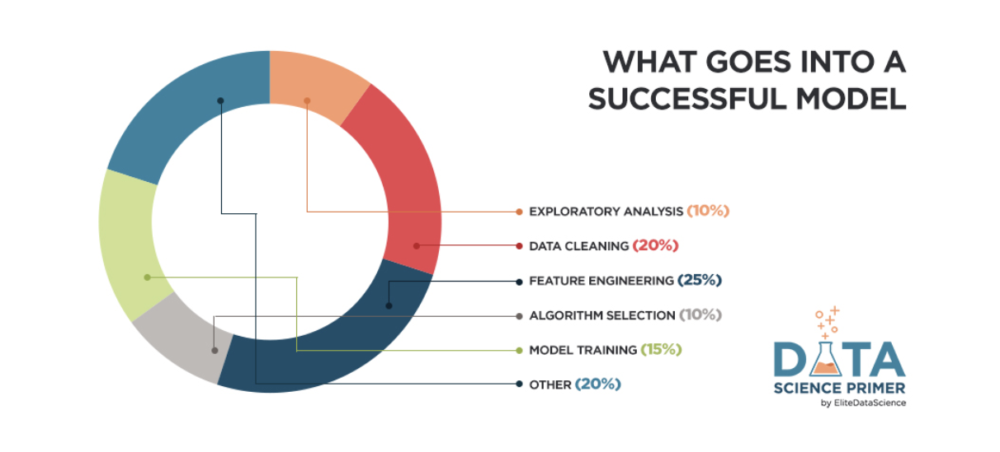
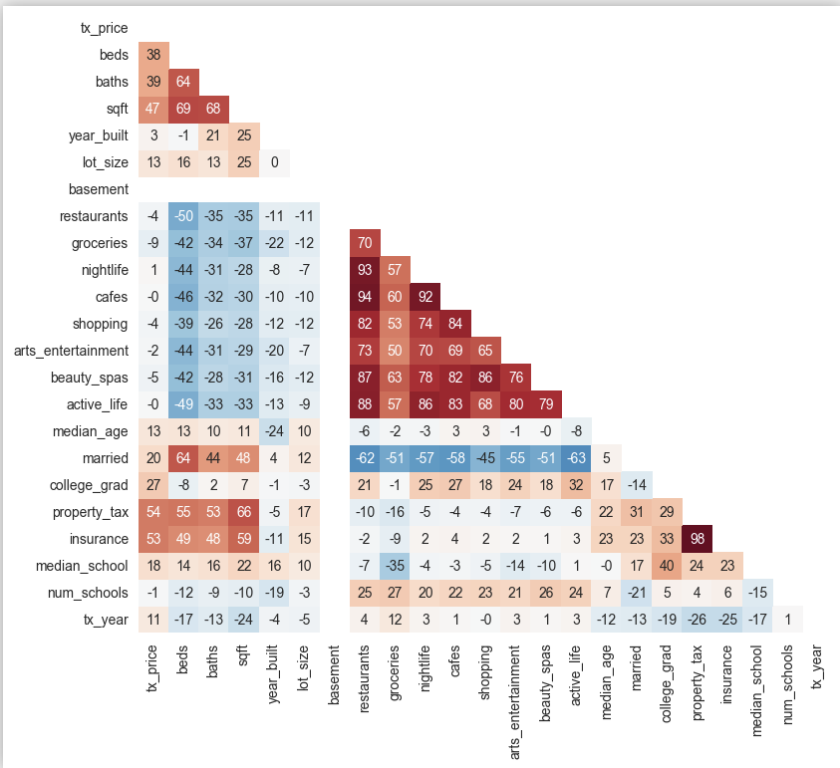

# Data Science
[Data Science Primer](https://elitedatascience.com/primer)

80/20 breakdown of data science

big topics of this article are exploratory analysis, data cleaning, feature engineering, algorithm selection and model training.

Tip #1 - Don’t sweat the details (for now).

We’ve seen students master this subject 2X faster by first understanding how all the pieces fit together… and then diving deeper. Our trainings all follow this “top-down” approach.

Tip #2 - Don’t worry about coding (yet).

Again, it’s easy to get lost in the weeds at the beginning… so our goal is to see the forest instead of the trees. Don’t worry - We’ll get to the code later.

### Birds Eye View:

Machine learning is not about algorithms. It is a comprehensive approach to solving problems.

Supervised learning vs unsupervised learning. 
super- must tell algorithm what is right, and observation must be labeled something like 'correct answer'. Regression is the task for modeling continuous target variables. 

unsuper- youll allow the algorithm to direclty learn patterns from the data. clustering ts the most common unsupervised learning task, and its for finding groups within your data.

3 elements of great machine learning, a skilled chef(human guidance), fresh ingreadients(clean relevant data) and not overcooking it(avoid overfitting)

'better data beats fancy algorithms'

### Exploratory Analysis:

First, you'll want to answer a set of basic questions about the dataset:

How many observations do I have?
How many features?
What are the data types of my features? Are they numeric? Categorical?
Do I have a target variable?

Plot numerical distributions, violin plot
Plot Categorical distributions, bar plot
Plot Segmentations, box plot

Study correlations:
Positive correlation means that as one feature increases, the other increases. E.g. a child’s age and her height.
Negative correlation means that as one feature increases, the other decreases. E.g. hours spent studying and number of parties attended.
Correlations near -1 or 1 indicate a strong relationship.
Those closer to 0 indicate a weak relationship.
0 indicates no relationship.
Correlation heatmaps help you visualize this information. Here's an example (note: all correlations were multiplied by 100):

### Data Cleaning:

Cutting outliers is very important, case in point, my midterm. Cut duplicate observations, irrelevant observations, fix structural errors, handle missing data properly (dropping, or imputing)

### Feature Engineering:

In general, you can think of data cleaning as a process of subtraction and feature engineering as a process of addition.

This is often one of the most valuable tasks a data scientist can do to improve model performance, for 3 big reasons:

You can isolate and highlight key information, which helps your algorithms "focus" on what’s important.
You can bring in your own domain expertise.
Most importantly, once you understand the "vocabulary" of feature engineering, you can bring in other people’s domain expertise!

combine sparse classes

Add dummy variables

Remove unused features, id columns, features that wouldnt be available at the time of prediction, other text descriptions.

### Algorithm Selection:

Linear regression is bunk, dont use it. Its deeply flawed and prove to overfitting.

Instead shoot for Lasso Regression, Ridge Regression, or Elastic Net which is a compromise of lasso and ridge.

### Model Training:

Better data beats fancier algorithms

[Back To Homepage](https://leethomas13.github.io/201-reading-notes/)
